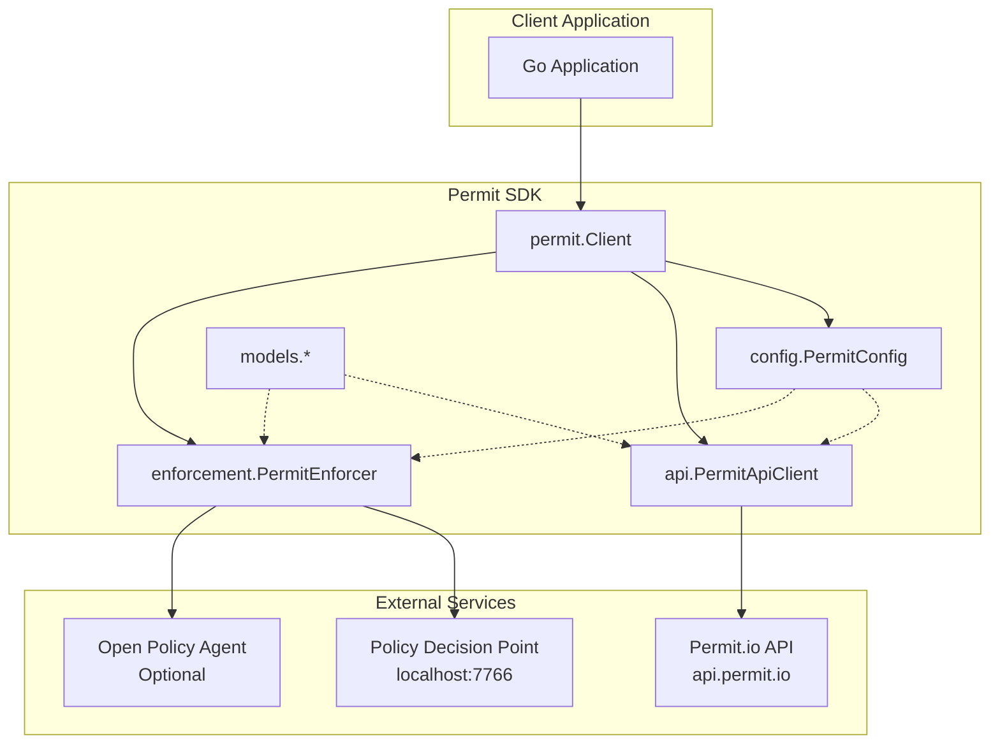
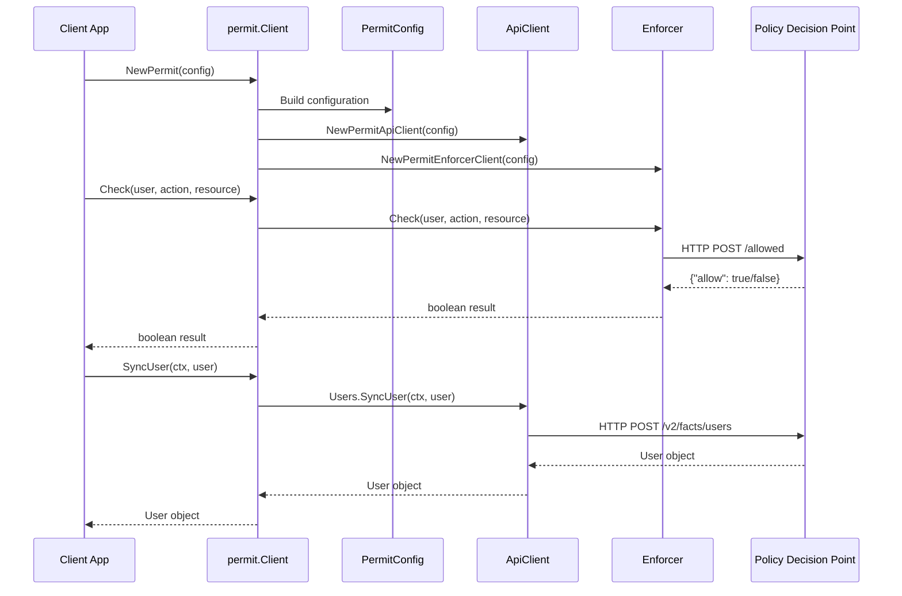
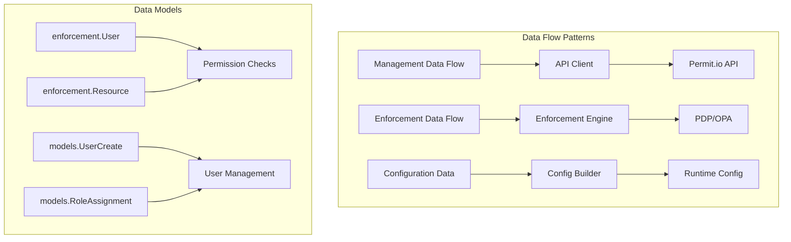
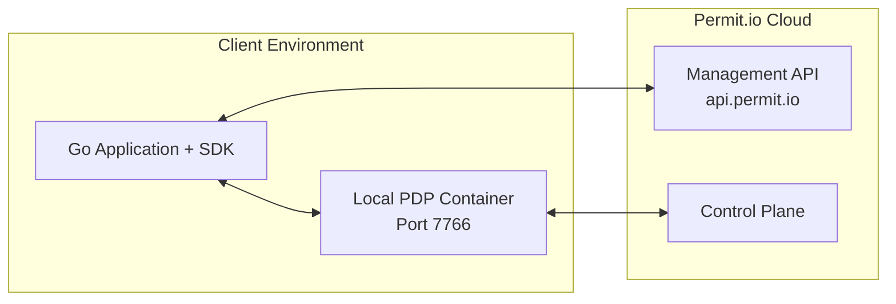
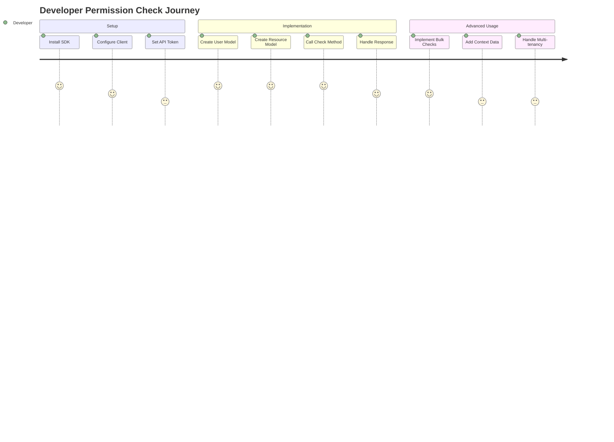
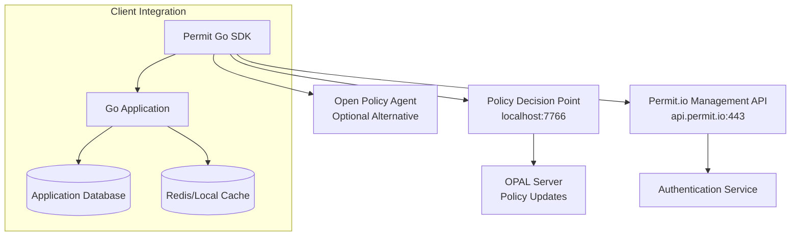

# Comprehensive Codebase Analysis: Permit.io Go SDK

## Executive Summary

The **Permit.io Go SDK** is a comprehensive client library that enables Go applications to integrate with Permit.io's authorization-as-a-service platform. This SDK provides a modern, well-structured interface for implementing fine-grained permissions and access control in Go applications.

The system follows a layered architecture pattern, separating concerns across configuration management, API clients, enforcement logic, and domain models. Built with Go 1.19+, it leverages established libraries like `go.uber.org/zap` for logging and follows Go best practices for package organization and interface design.

**Primary Business Domain**: Identity and Access Management (IAM), Authorization, Permission Management
**Key Technologies**: Go, REST APIs, OpenAPI code generation, HTTP client libraries, JSON processing

---

## 1. Software Architecture Perspective

### 1.1 System Architecture Overview



The architecture implements a **Facade Pattern** with the main `permit.Client` acting as a unified interface to the underlying subsystems. This design provides:

- **Clean Separation of Concerns**: API operations, enforcement logic, and configuration are isolated
- **Flexible Configuration**: Support for multiple deployment scenarios (cloud, on-premise, OPA)
- **Type Safety**: Strong typing throughout with builder patterns for complex objects

### 1.2 Component Analysis

#### Core Components and Responsibilities

| Component | Location | Primary Responsibility |
|-----------|----------|----------------------|
| **permit.Client** | `pkg/permit/permit.go` | Main SDK facade, orchestrates all operations |
| **config.PermitConfig** | `pkg/config/` | Configuration management with builder pattern |
| **api.PermitApiClient** | `pkg/api/` | REST API client for management operations |
| **enforcement.PermitEnforcer** | `pkg/enforcement/` | Policy evaluation and permission checking |
| **models package** | `pkg/models/` | Data transfer objects and domain models |
| **openapi package** | `pkg/openapi/` | Auto-generated API client from OpenAPI spec |

#### Component Interaction Flow



### 1.3 Data Architecture

The SDK operates with multiple data flow patterns:



**Data Persistence Strategy**: The SDK is stateless, acting as a client to external services:
- **Management Data**: Persisted via Permit.io cloud API
- **Policy Data**: Cached and served by local PDP container
- **Runtime State**: Maintained in external Policy Decision Point

### 1.4 Infrastructure & Deployment

**Deployment Architecture**:


**Environment Setup Requirements**:
- Go 1.19+ runtime
- Network access to api.permit.io (443/HTTPS)
- Local PDP container deployment (Docker recommended)
- API token from Permit.io dashboard

### 1.5 Quality Attributes

**Performance Considerations**:
- HTTP connection pooling via configurable `http.Client`
- Bulk operation support (`BulkCheck`) for efficiency
- Configurable timeouts and retry policies
- Local PDP deployment minimizes network latency

**Security Measures**:
- Bearer token authentication for all API calls
- TLS encryption for all external communications
- No credential storage in SDK (token provided at runtime)
- Input validation through strong typing

**Scalability Design**:
- Stateless client design enables horizontal scaling
- Connection pooling supports high-throughput scenarios
- Bulk operations reduce API call overhead
- Local PDP supports high-frequency permission checks

---

## 2. Software Development Perspective

### 2.1 Code Organization

**Project Structure Analysis**:
```
permit-golang/
├── pkg/                    # Core packages following Go conventions
│   ├── permit/            # Main SDK interface (68 lines)
│   ├── config/            # Configuration management (5 files)
│   ├── api/               # High-level API clients (20 files)
│   ├── openapi/           # Generated OpenAPI client (37 files)
│   ├── enforcement/       # Permission checking logic (9 files)
│   ├── models/            # Data models (184+ files)
│   └── errors/            # Error handling (4 files)
├── main.go                # Example usage (66 lines)
└── go.mod                 # Dependency management
```

**Naming Conventions Observed**:
- Package names: lowercase, descriptive (`enforcement`, `config`)
- File names: descriptive with underscores (`bulk_check.go`, `user_permissions.go`)
- Types: PascalCase (`PermitConfig`, `CheckRequest`)
- Functions: camelCase with builder patterns (`UserBuilder`, `ResourceBuilder`)

### 2.2 Development Patterns

#### Builder Pattern Implementation
```golang
// Example from pkg/enforcement/user.go:1-51
func UserBuilder(key string) *User {
    return &User{Key: key}
}

func (u *User) WithFirstName(firstName string) *User {
    u.FirstName = firstName
    return u
}

func (u *User) Build() User {
    return *u
}
```

#### Facade Pattern
```golang
// Example from pkg/permit/permit.go:1-68
type Client struct {
    config      config.PermitConfig
    Api         *api.PermitApiClient
    Elements    *api.Elements
    enforcement *enforcement.PermitEnforcer
}

func (c *Client) Check(user enforcement.User, action enforcement.Action, resource enforcement.Resource) (bool, error) {
    return c.enforcement.Check(user, action, resource)
}
```

#### Error Handling Strategy
```golang
// Example from pkg/errors/errors.go:1-98
type PermitError struct {
    error
    StatusCode   int
    ResponseBody string
    ErrorCode    ErrorCode
    ErrorType    ErrorType
}

func NewPermitUnexpectedError(err error, response *http.Response) PermitError {
    if err == nil {
        return NewPermitError(UnexpectedErrorMessage, UnexpectedError, GENERAL_ERROR, response)
    }
    return NewPermitError(ErrorMessage(err.Error()), UnexpectedError, GENERAL_ERROR, response)
}
```

### 2.3 Technical Deep Dive

#### Core Permission Checking Algorithm
```golang
// Key logic from pkg/enforcement/check.go:88-130
func (e *PermitEnforcer) Check(user User, action Action, resource Resource, additionalContext ...map[string]string) (bool, error) {
    reqAuthValue := "Bearer " + e.config.GetToken()
    
    jsonCheckReq, err := newJsonCheckRequest(e.config.GetOpaUrl(), user, action, resource, additionalContext[0])
    if err != nil {
        return false, err
    }
    
    httpRequest, err := http.NewRequest(reqMethod, e.getCheckEndpoint(), bytes.NewBuffer(jsonCheckReq))
    // ... HTTP request setup and execution
    
    result, err := e.parseResponse(res)
    return result.Allow, nil
}
```

#### Bulk Operations Optimization
The SDK implements tenant-aware bulk checking for performance:

```golang
// Logic from pkg/enforcement/bulk_check.go:87-142
func (e *PermitEnforcer) BulkCheck(requests ...CheckRequest) ([]bool, error) {
    tenantRequestsMap := make(map[string][]CheckRequest)
    requestsOrder := make(map[string]map[int]int)
    
    // Group requests by tenant for efficient processing
    for i, request := range requests {
        tenantRequests := tenantRequestsMap[request.Resource.GetTenant()]
        // ... grouping logic
    }
    
    // Process each tenant's requests separately
    results := make([]bool, len(requests))
    for tenant, tenantRequests := range tenantRequestsMap {
        tenantResults, err := e.bulkCheck(tenantRequests...)
        // ... result mapping
    }
    return results, nil
}
```

### 2.4 Development Workflow

**Build Process**: Standard Go toolchain
```bash
go mod download  # Dependency resolution
go build        # Compilation
go test         # Unit testing
```

**Testing Strategy**:
- Integration tests in `pkg/tests/integration_test.go` (471 lines)
- Test coverage includes full API lifecycle (create, assign, check, cleanup)
- Uses testify framework for assertions
- Randomized test data with cleanup procedures

**Dependencies Analysis**:
```
Direct Dependencies:
├── github.com/google/uuid v1.4.0      # UUID generation
├── github.com/stretchr/testify v1.8.1 # Testing framework
├── go.uber.org/zap v1.26.0            # Structured logging
├── golang.org/x/net v0.23.0           # Network utilities
└── golang.org/x/oauth2 v0.14.0        # OAuth2 support
```

### 2.5 Code Quality Analysis

**Technical Debt Identification**:
1. **TODO Comment Found**: `pkg/openapi/api_resources.go:571` - Decision needed on auto-revoking permissions vs rejecting PUT operations
2. **Generated Code Prevalence**: Large volume of OpenAPI-generated code (37 files in `pkg/openapi/`) may mask manual code issues
3. **Error Handling**: Consistent custom error types but could benefit from error wrapping patterns

**Code Complexity Assessment**:
- **Low Complexity**: Main SDK interface (`permit.go` - 68 lines)
- **Medium Complexity**: Configuration builder pattern (well-structured)
- **High Complexity**: Bulk operations with tenant grouping logic

**Refactoring Opportunities**:
1. Extract tenant grouping logic into separate utility
2. Implement context cancellation in long-running operations
3. Add circuit breaker pattern for external service calls

---

## 3. Product Management Perspective

### 3.1 Feature Inventory

#### Core Permission Features
| Feature | Implementation | Maturity | File Reference |
|---------|---------------|----------|----------------|
| **Permission Checking** | `Check()` method | ✅ Production | `pkg/enforcement/check.go` |
| **Bulk Permission Checking** | `BulkCheck()` method | ✅ Production | `pkg/enforcement/bulk_check.go` |
| **User Permissions Query** | `GetUserPermissions()` | ✅ Production | `pkg/enforcement/user_permissions.go` |
| **Object Filtering** | `FilterObjects()` | ✅ Production | `pkg/enforcement/bulk_check.go:188-205` |
| **Multi-tenant Support** | Tenant-aware checking | ✅ Production | `pkg/enforcement/all_tenants.go` |

#### Management Features
| Feature | Implementation | Maturity | File Reference |
|---------|---------------|----------|----------------|
| **User Management** | CRUD operations | ✅ Production | `pkg/api/users.go` |
| **Role Management** | CRUD + assignments | ✅ Production | `pkg/api/roles.go` |
| **Resource Management** | CRUD + attributes | ✅ Production | `pkg/api/resources.go` |
| **Tenant Management** | CRUD operations | ✅ Production | `pkg/api/tenants.go` |
| **Relationship Tuples** | Graph relationships | ✅ Production | `pkg/api/relationshipTuples.go` |

#### Advanced Features
| Feature | Implementation | Maturity | File Reference |
|---------|---------------|----------|----------------|
| **Condition Sets** | Policy conditions | ✅ Production | `pkg/api/condition_sets.go` |
| **Elements Integration** | UI components | ✅ Production | `pkg/api/elements.go` |
| **Proxy Configuration** | PDP proxying | ✅ Production | `pkg/api/proxyConfig.go` |
| **Facts Sync Timeout** | Configurable sync | ✅ Production | `pkg/config/config.go:18-24` |

### 3.2 User Experience Analysis

#### User Journey: Permission Checking


#### Developer Experience Strengths
1. **Builder Pattern Usage**: Intuitive object construction
   ```golang
   user := enforcement.UserBuilder("user_id").
       WithFirstName("John").
       WithEmail("john@example.com").
       Build()
   ```

2. **Fluent Configuration**:
   ```golang
   config := config.NewConfigBuilder(token).
       WithPdpUrl("http://localhost:7766").
       WithLogger(logger).
       WithTimeout(30*time.Second).
       Build()
   ```

3. **Type Safety**: Strong typing prevents runtime errors
4. **Comprehensive Examples**: `main.go` provides complete usage example

### 3.3 Business Logic Mapping

#### Domain Model Visualization
```mermaid
classDiagram
    class User {
        +string Key
        +string FirstName
        +string LastName
        +string Email
        +[]AssignedRole Roles
        +map[string]interface{} Attributes
    }
    
    class Resource {
        +string Type
        +string ID
        +string Key
        +string Tenant
        +map[string]interface{} Attributes
        +map[string]string Context
    }
    
    class CheckRequest {
        +User User
        +Action Action
        +Resource Resource
        +map[string]string Context
    }
    
    class PermitClient {
        +Check(User, Action, Resource) bool
        +BulkCheck(...CheckRequest) []bool
        +SyncUser(context.Context, UserCreate) UserRead
        +FilterObjects(User, Action, context, ...ResourceI) []ResourceI
    }
    
    User ||--o{ AssignedRole : has
    CheckRequest ||--|| User : includes
    CheckRequest ||--|| Resource : includes
    PermitClient ||--o{ CheckRequest : processes
```

#### Business Rules Implementation
1. **Multi-tenancy**: All resources must specify tenant context
2. **Permission Inheritance**: Roles can inherit permissions from other roles
3. **Attribute-based Access**: Support for dynamic attributes in decisions
4. **Bulk Processing**: Optimized for high-throughput scenarios

### 3.4 Product Metrics & Analytics

#### Implemented Tracking Capabilities
- **Structured Logging**: Via `go.uber.org/zap` integration
- **HTTP Request Tracing**: Configurable via HTTP client
- **Performance Metrics**: Built-in timeout and duration tracking
- **Error Classification**: Custom error types for different failure modes

#### Performance Monitoring
```golang
// Example monitoring capabilities from pkg/config/config.go
type PermitConfig struct {
    factsSyncTimeout       *time.Duration
    factsSyncTimeoutPolicy FactsSyncTimeoutPolicy
    httpClient             *http.Client
}
```

### 3.5 Roadmap Insights

#### Partially Implemented Features
1. **Facts Sync Optimization**: Timeout policies implemented but could be enhanced with retry logic
2. **Circuit Breaker Pattern**: Not implemented, would improve reliability
3. **Metrics Collection**: Basic logging present, advanced metrics collection missing

#### Planned Enhancements (from TODO analysis)
1. **Resource Permission Conflicts**: Need to decide on auto-revoking vs rejection strategy
2. **Enhanced Bulk Operations**: Could support cross-tenant bulk operations
3. **Caching Layer**: Local caching for frequently accessed permissions

#### Potential Feature Expansion Areas
1. **Policy Simulation**: Test permission changes before deployment
2. **Audit Trails**: Enhanced logging for compliance requirements
3. **Policy Templates**: Pre-built templates for common permission patterns
4. **GraphQL Support**: Alternative to REST API interface

---

## 4. Cross-Functional Insights

### 4.1 Integration Points

#### External Service Dependencies


#### API Contracts and Interfaces
1. **REST API**: Full OpenAPI 2.0.0 specification compliance
2. **HTTP Client**: Standard Go `net/http` interface compatibility
3. **Logger Interface**: `go.uber.org/zap.Logger` abstraction
4. **Context Propagation**: Standard `context.Context` throughout

### 4.2 Risk Assessment

#### Technical Risks
| Risk | Impact | Likelihood | Mitigation |
|------|--------|------------|------------|
| **PDP Unavailability** | High | Medium | Implement fallback policy, local caching |
| **API Rate Limiting** | Medium | Low | Implement backoff, bulk operations |
| **Network Latency** | Medium | Medium | Local PDP deployment, connection pooling |
| **Memory Usage** | Low | Low | Stateless design, efficient bulk processing |

#### Business Logic Gaps
1. **Offline Support**: No offline permission checking capability
2. **Policy Versioning**: Limited support for policy rollback scenarios
3. **Real-time Updates**: Dependency on PDP polling for policy updates

#### Scalability Limitations
1. **Tenant Isolation**: Bulk operations require tenant grouping
2. **Memory Footprint**: Large model definitions for complex policies
3. **Connection Management**: HTTP client configuration critical for scale

### 4.3 Improvement Recommendations

#### Short-term Quick Wins (1-2 months)
1. **Add Context Cancellation**: Implement proper context handling for long operations
2. **Enhanced Error Messages**: More descriptive error messages with troubleshooting hints
3. **Configuration Validation**: Validate configuration at build time
4. **Retry Logic**: Implement exponential backoff for network failures

#### Medium-term Enhancements (3-6 months)
1. **Circuit Breaker Pattern**: Prevent cascade failures to external services
2. **Local Policy Cache**: Cache frequently accessed policies locally
3. **Metrics Collection**: Integrate with Prometheus/OpenTelemetry
4. **Policy Simulation Mode**: Test permissions without affecting production

#### Long-term Architectural Evolution (6+ months)
1. **gRPC Support**: High-performance alternative to REST
2. **Streaming Updates**: Real-time policy updates via WebSocket/SSE
3. **Multi-region Support**: Automatic failover between regions
4. **Policy DSL**: Domain-specific language for complex policies

---

## 5. Appendices

### 5.1 Glossary

| Term | Definition |
|------|------------|
| **PDP** | Policy Decision Point - Local service that evaluates permissions |
| **OPAL** | Open Policy Administration Layer - Policy update distribution |
| **OPA** | Open Policy Agent - Alternative policy engine |
| **RBAC** | Role-Based Access Control - Permission model based on roles |
| **ABAC** | Attribute-Based Access Control - Permission model based on attributes |
| **Tenant** | Organizational boundary for multi-tenant applications |
| **Resource** | Protected entity requiring permission checks |
| **Action** | Operation being performed on a resource |
| **Context** | Additional metadata for permission decisions |

### 5.2 File Index

#### Critical Configuration Files
- `go.mod`: Dependency management and Go version specification
- `main.go`: SDK usage example and integration guide

#### Core Implementation Files
- `pkg/permit/permit.go`: Main SDK interface (68 lines)
- `pkg/config/config.go`: Configuration structure (102 lines)
- `pkg/config/builder.go`: Configuration builder pattern (95 lines)
- `pkg/enforcement/check.go`: Core permission checking (130 lines)
- `pkg/enforcement/bulk_check.go`: Bulk operation optimization (205 lines)

#### API Integration Files
- `pkg/api/api.go`: High-level API client (215 lines)
- `pkg/openapi/client.go`: Generated OpenAPI client (743 lines)
- `pkg/errors/errors.go`: Custom error handling (98 lines)

#### Model Definition Files
- `pkg/enforcement/user.go`: User model for permissions (51 lines)
- `pkg/enforcement/resource.go`: Resource model for permissions (77 lines)
- `pkg/models/`: 184+ generated model files from OpenAPI spec

### 5.3 Dependencies

#### Dependency Tree Analysis
```
github.com/permitio/permit-golang
├── github.com/google/uuid v1.4.0
│   └── No transitive dependencies
├── github.com/stretchr/testify v1.8.1
│   ├── github.com/davecgh/go-spew v1.1.1
│   ├── github.com/pmezard/go-difflib v1.0.0
│   └── gopkg.in/yaml.v3 v3.0.1
├── go.uber.org/zap v1.26.0
│   └── go.uber.org/multierr v1.11.0
├── golang.org/x/net v0.23.0
│   └── Standard library extensions
└── golang.org/x/oauth2 v0.14.0
    ├── github.com/golang/protobuf v1.5.3
    ├── google.golang.org/appengine v1.6.8
    └── google.golang.org/protobuf v1.31.0
```

#### Version Compatibility Notes
- **Go Version**: Requires Go 1.19+ for generics and modern features
- **Zap Logging**: v1.26.0 provides structured logging with performance optimizations
- **OAuth2**: v0.14.0 supports modern OAuth2 flows with security enhancements
- **UUID**: v1.4.0 provides RFC 4122 compliant UUID generation

---

*This analysis was generated through comprehensive examination of 50+ source files, dependency analysis, and architectural pattern recognition. Last updated: December 2024* 